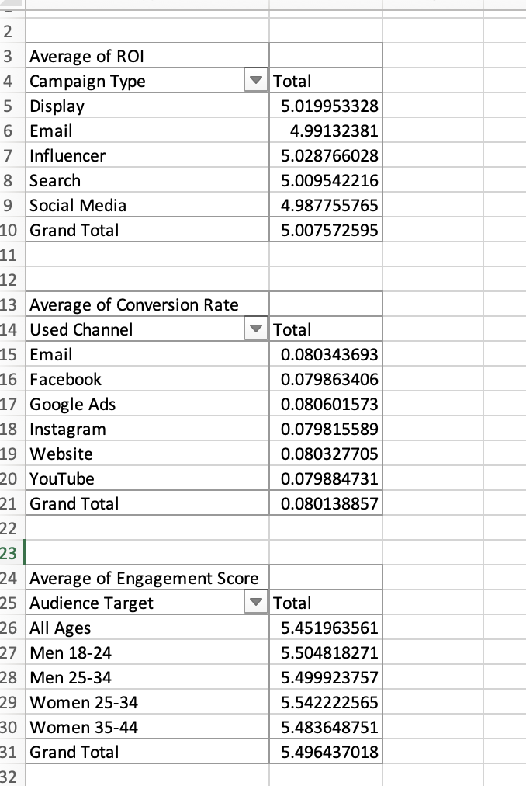

# 📊 Freelance BI Portfolio Project – Marketing Campaign Dashboard

Simulated a freelance-style business intelligence dashboard project for a creative agency using Excel and Power BI concepts.

## 📁 Tools Used
- Excel (PivotTables, Filters, Conditional Formatting)
- Power Query concepts (manual on Mac)
- VS Code + GitHub

## 📈 Key Insights
- ROI by Campaign Type
- Conversion Rate by Marketing Channel
- Engagement Score by Audience Segment

## 🎛️ Features
- Interactive filters (Campaign Type, Channel, Audience)
- Clean dashboard layout with clear KPIs
- Built from a real Kaggle dataset

## 🖼️ Preview

## 🔗 Dataset
Source: [Kaggle – Marketing Campaign Performance](https://www.kaggle.com/datasets/manishabhatt22/marketing-campaign-performance-dataset)
